# BullKeeper Kids 

Tool aimed at children/adolescents to manage their fun time and ensure the rules of parental control set.

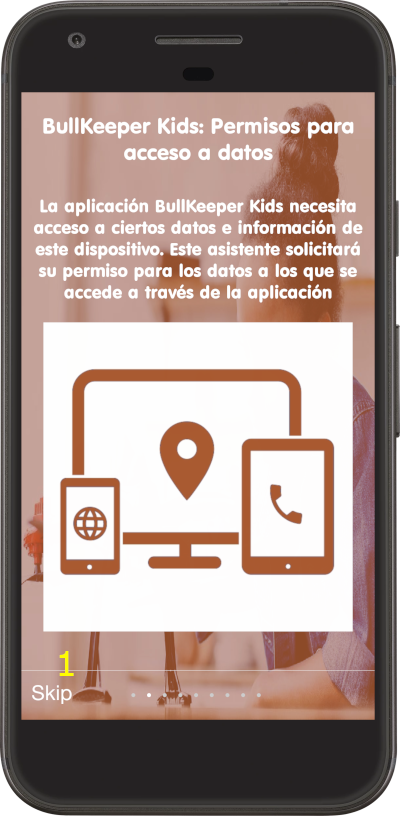
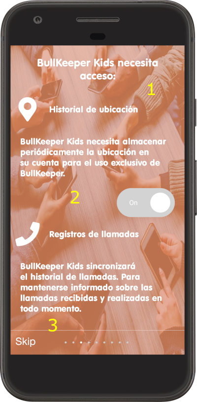

It has an assistant to configure all the necessary permissions and access for the correct operation of the application.

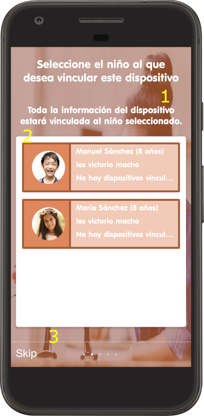
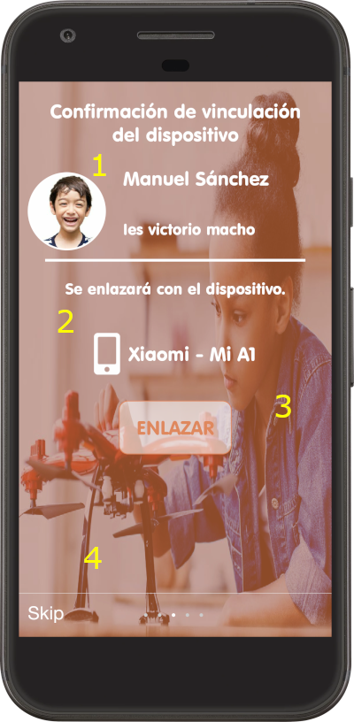

Must be linked to a child / teen account created from the BullKeeper application.

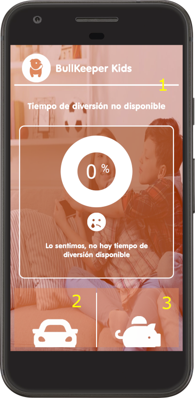
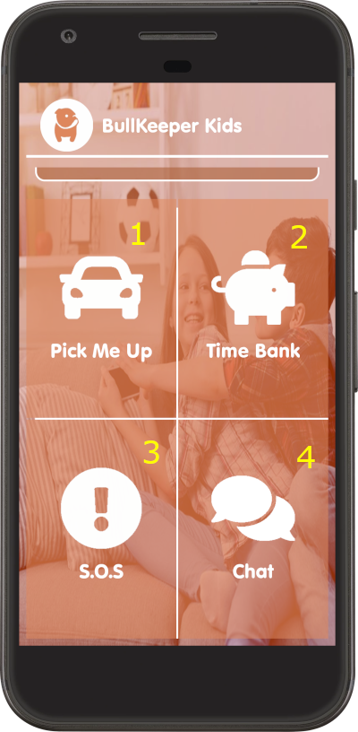

The application will synchronize all device resources and ensure that any changes in them are notified.

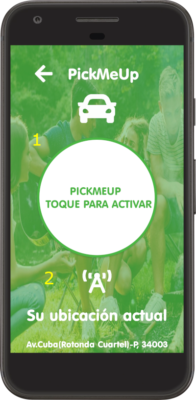
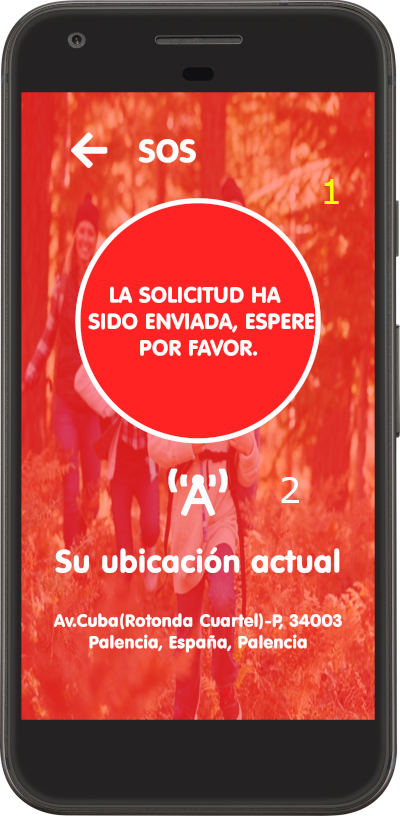

The adolescent child can send help and pick me up notices from the application.

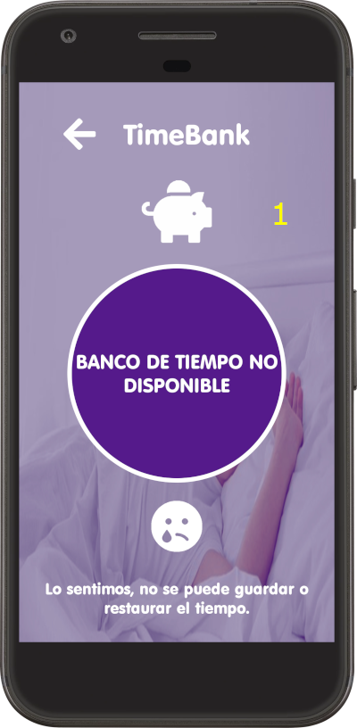
  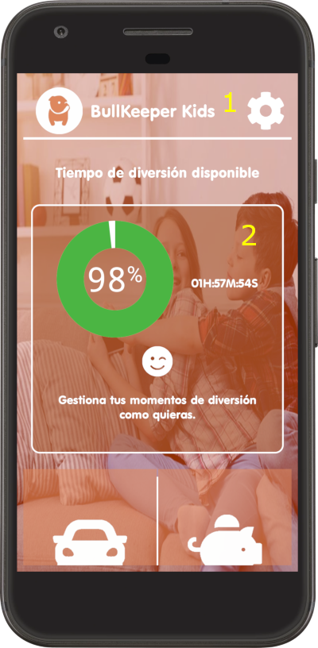

It has an integrated messaging system that will allow the child / adolescent to communicate with one of their supervisors.

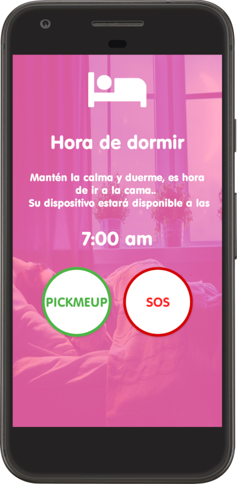
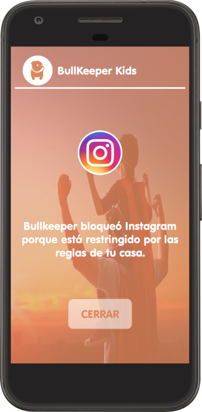

The application will control the use of the device at all times.

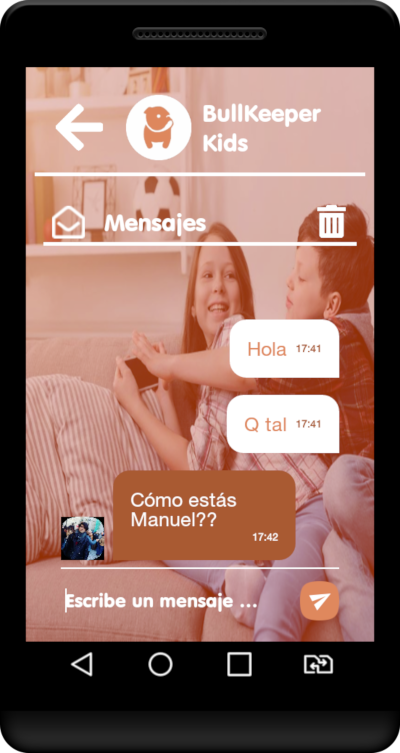

