# BullKeeper Kids Android App - Empowering Young Digital Explorers! 🎉

Introducing the **BullKeeper Kids Android App**, a dynamic and engaging tool tailored for children and adolescents to responsibly manage their recreational time while adhering to parental control rules. 📱👦👧

## ⚠️ Disclaimer  

**BullKeeper Kids** is a project designed **solely for advanced learning purposes** on the Android platform. Its development explores the implementation of **time management and parental control tools**, providing insights into permission handling, device synchronization, and communication in mobile applications.  

This project is **experimental** and is not intended for production use or as a commercial solution. Its functionality is not guaranteed outside the scope of testing and learning.  

## Fun Time Management 🌟

**BullKeeper Kids** empowers young digital enthusiasts to find the perfect balance between fun and responsibility. It's all about creating a safe and enjoyable digital adventure where kids can learn, play, and grow, all while respecting the rules set by their caring guardians. 🎮🕹️

## User-Friendly Assistant 🔧

With our user-friendly assistant, setup becomes a breeze. Easily configure essential permissions and access settings for seamless app operation. No tech wizardry required! 🤖🛠️

## Child/Teen Account Integration 👪

Seamlessly connect to a child or teen account created from the **BullKeeper** application. This integration ensures a secure and personalized digital environment where young users can explore and learn safely. 👨‍👩‍👧‍👦🔗

## Synchronized Device Resources 🔄

Stay in the loop with **BullKeeper Kids**! The app automatically synchronizes all device resources, promptly notifying you of any changes. You'll never miss a beat in your child's digital journey. 🔄📡

## Emergency Alerts and Safety 🆘

For added safety and peace of mind, adolescents can send help and "pick me up" alerts directly from the app. 🚨 Whether they need assistance or just want to check in, help is always within reach. 🆘

## Integrated Messaging System 💬

**BullKeeper Kids** fosters communication. Our integrated messaging system enables children and adolescents to connect with their supervisors effortlessly. Stay connected, stay safe, and enjoy the journey together! 💬📞

## Device Usage Control ⏰🔒

Rest easy knowing that the app keeps tabs on device usage around the clock. Parental control rules are enforced, ensuring a healthy balance between screen time and other enriching activities. ⌛🔒

## Screenshots 📸

Take a sneak peek at **BullKeeper Kids** with these screenshots:

Tool aimed at children/adolescents to manage their fun time and ensure the rules of parental control set.

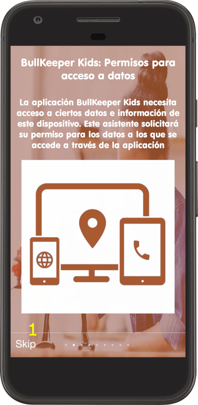
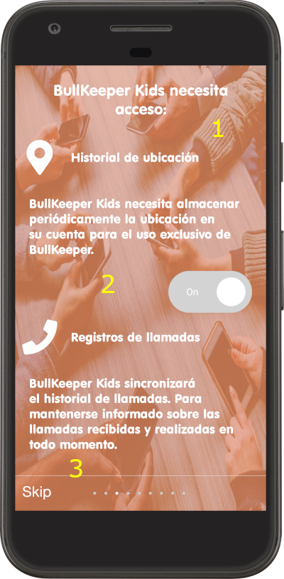

It has an assistant to configure all the necessary permissions and access for the correct operation of the application.

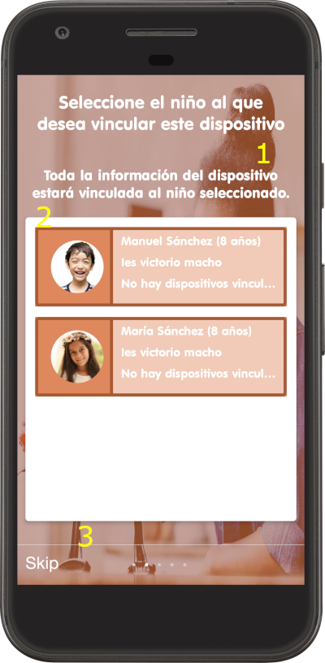
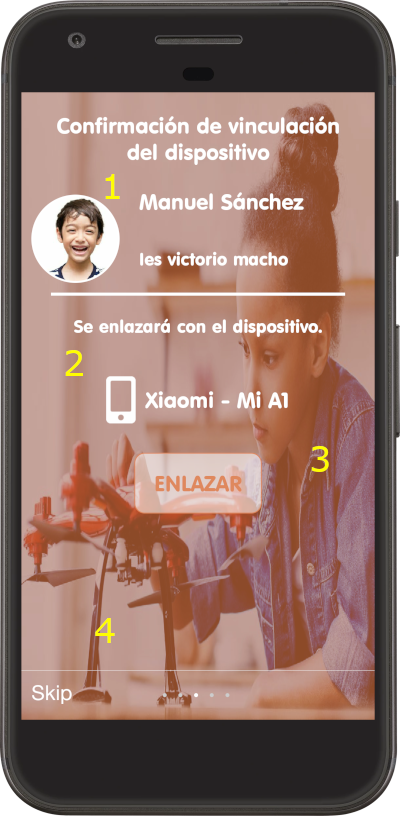

Must be linked to a child / teen account created from the BullKeeper application.

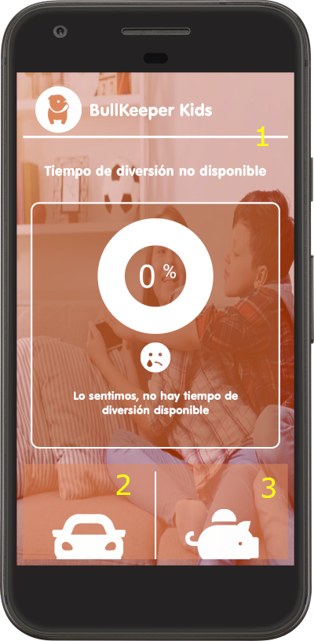
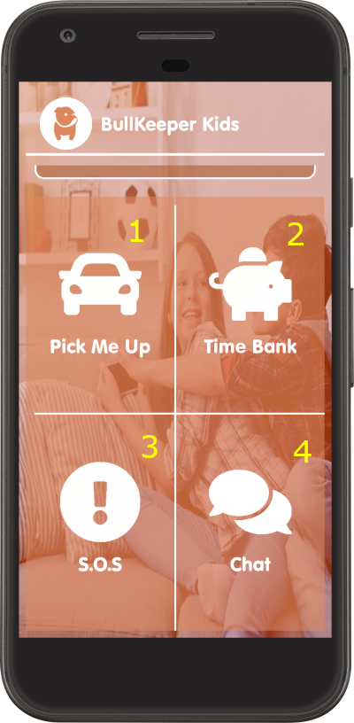

The application will synchronize all device resources and ensure that any changes in them are notified.

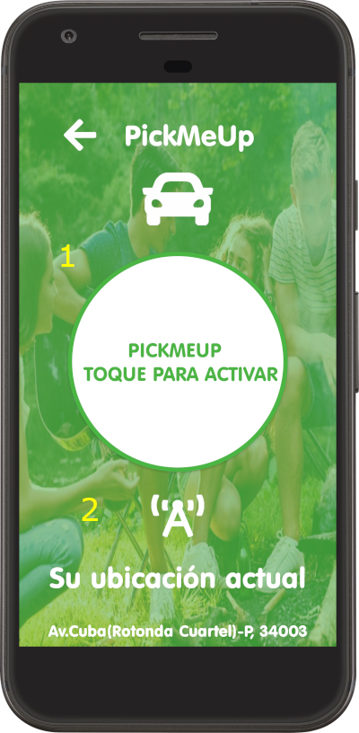
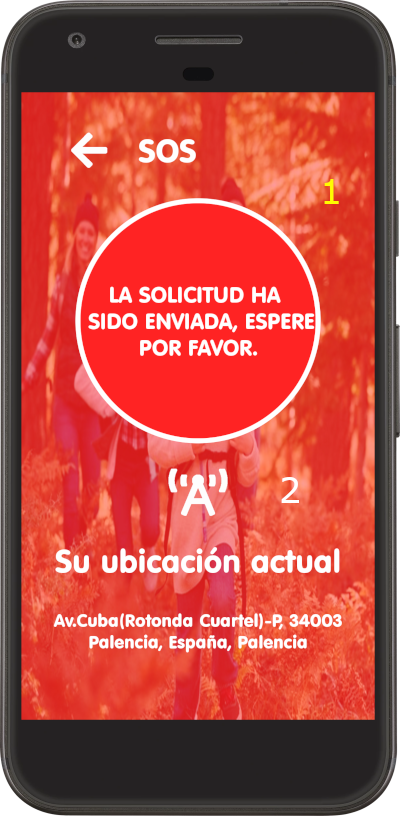

The adolescent child can send help and pick me up notices from the application.

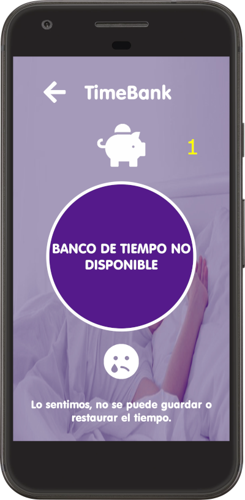
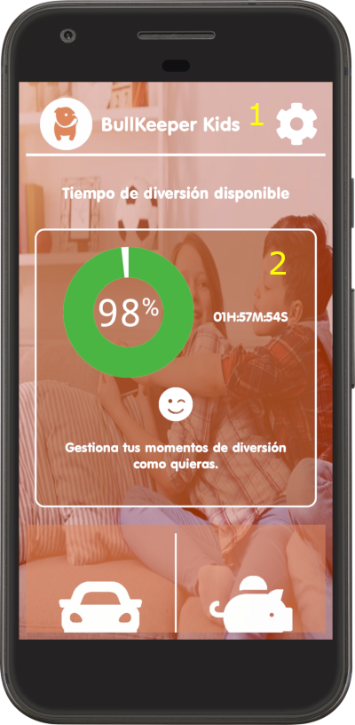

It has an integrated messaging system that will allow the child / adolescent to communicate with one of their supervisors.

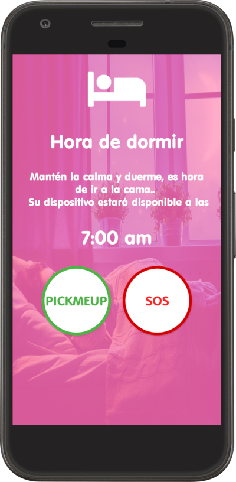
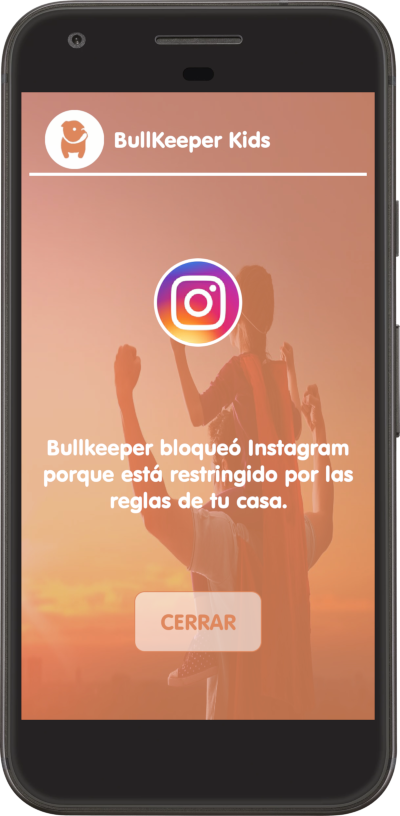

The application will control the use of the device at all times.

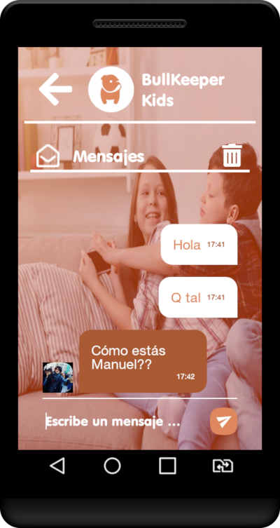

Join the **BullKeeper Kids** community, where young digital explorers embark on a journey of learning, fun, and responsibility. Let's create a digital world that's both exciting and safe for our children. 🌈

**For Happy and Safe Digital Adventures:** Trust **BullKeeper Kids** to empower your child with responsible digital habits and ensure a secure, enjoyable online experience. 🚀🧒🧑

## Visitors Count

## Please Share & Star the repository to keep me motivated.
  

